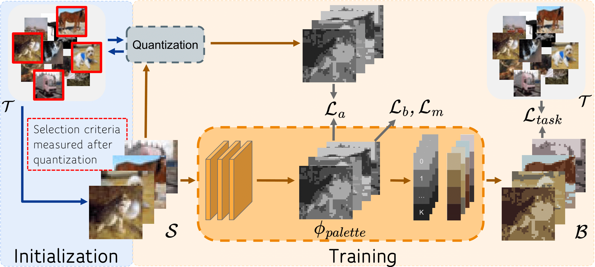

# Color-Oriented Redundancy Reduction in Dataset Distillation
This repository includes the implementation for *Color-Oriented Redundancy Reduction in Dataset Distillation* (Neurips 2024) [](https://arxiv.org/abs/2411.11329).

## TODOs

- [x] Upload source code.
- [ ] Working on instructions.

## Usage

### Requirements

```
torch==2.2.2
torchvision==0.17.2
```

## INTRO
Dataset Distillation (DD) is designed to generate condensed representations of
extensive image datasets, enhancing training efficiency. Despite recent advances,
there remains considerable potential for improvement, particularly in addressing
the notable redundancy within the color space of distilled images. In this paper,
we propose AutoPalette, a framework that minimizes color redundancy at the
individual image and overall dataset levels, respectively. At the image level, we
employ a palette network, a specialized neural network, to dynamically allocate
colors from a reduced color space to each pixel. The palette network identifies
essential areas in synthetic images for model training and consequently assigns
more unique colors to them. At the dataset level, we develop a color-guided
initialization strategy to minimize redundancy among images.


<!--  -->


### Image Initialization
Run the command below and a initialization checkpoint will be saved:

```bash
cd selection
python main.py --ipc 10 --dataset CIFAR10_Medcut --data_path your_save_path --workers 32 --optimizer SGD -se 50 --model ConvNetD3 --lr 0.001  --batch 128  --n_color 64 
```


### Run Distillation
First set up a config file following the examples in config folder. Then run the command
```bash
cd distill
python distill_quant.py --cfg your_config_path --lr_quant 0.05 --num_colors 64 --color_model color_cnn --subset_ckpt init_ckpt
```


